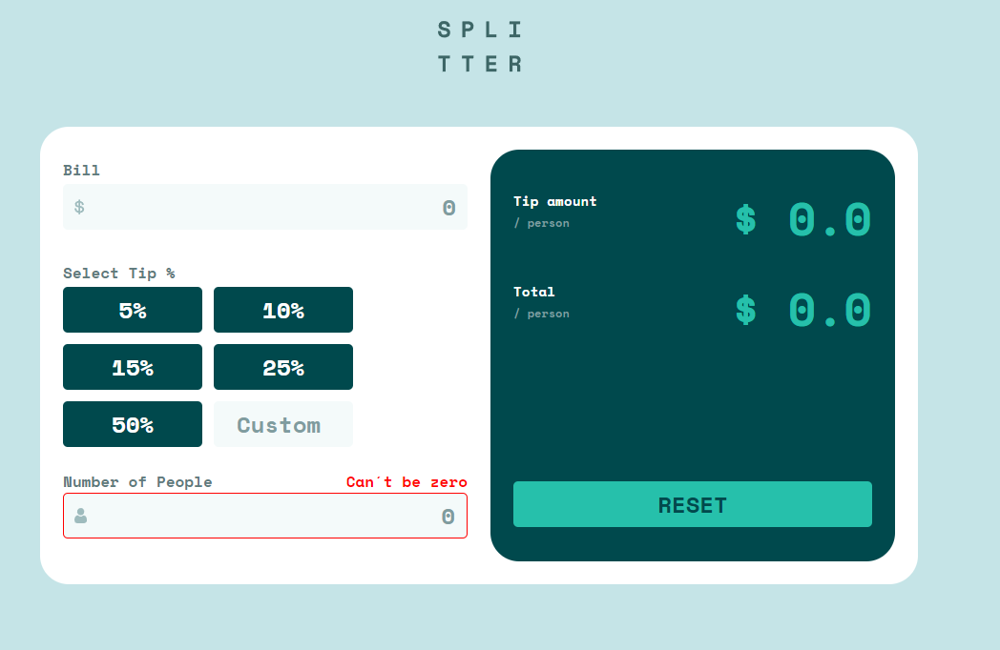
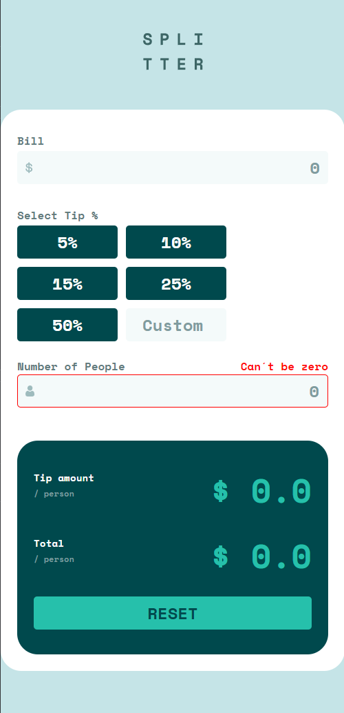
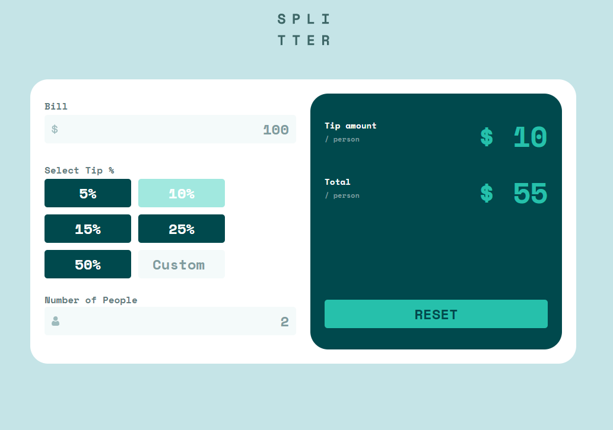

# Frontend Mentor - Tip calculator app solution

This is a solution to the [Tip calculator app challenge on Frontend Mentor](https://www.frontendmentor.io/challenges/tip-calculator-app-ugJNGbJUX). Frontend Mentor challenges help you improve your coding skills by building realistic projects.

## Table of contents

- [Overview](#overview)
  - [The challenge](#the-challenge)
  - [Screenshot](#screenshot)
  - [Links](#links)
- [My process](#my-process)
  - [Built with](#built-with)
  - [What I learned](#what-i-learned)
  - [Continued development](#continued-development)
  - [Useful resources](#useful-resources)
- [Author](#author)

## Overview

### The challenge

Users should be able to:

- View the optimal layout for the app depending on their device's screen size
- See hover states for all interactive elements on the page
- Calculate the correct tip and total cost of the bill per person

### Screenshot





### Links

- Solution URL: [Add solution URL here](https://your-solution-url.com)
- Live Site URL: [Add live site URL here](https://your-live-site-url.com)

## My process

### Built with

- Semantic HTML5 markup
- CSS custom properties
- Flexbox
- CSS Grid
- Mobile-first workflow


### What I learned

In this project I learned how I can point to a DOM element without having to do a document.getElementbyId.

I did this by adding an Event Listener to the entire document and so when I click on a part, it will return the id of the clicked element, this can be seen in e.targe

```js
const checkPercentage = (e)=>{
    
    if(e.target.id =="5%"){
        percentageValue = 5
        customInput.value = ""
        clearBtnsStyle(e)
        
    }else if(e.target.id =="10%"){
        percentageValue = 10
        customInput.value = ""
        clearBtnsStyle(e)
        
    }else if(e.target.id =="15%"){
        percentageValue = 15
        customInput.value = ""
        clearBtnsStyle(e)
        
    }else if(e.target.id =="25%"){
        percentageValue = 25
        customInput.value = ""
        clearBtnsStyle(e)
        
    }else if(e.target.id =="50%"){
        percentageValue = 50
        customInput.value = ""
        clearBtnsStyle(e)
    }else if(e.target.id =="customInput"){
        percentageValue = 0
        clearBtnsStyle(e)
    }
```


### Useful resources

- [target Event Property:](https://www.w3schools.com/jsref/event_target.asp) - This is de documentation about the e.target

## Author

- Github - [Ricardo Halmoguera](https://github.com/RickHalmoguera)
- Frontend Mentor - [@RickHalmoguera](https://www.frontendmentor.io/profile/RickHalmoguera)


